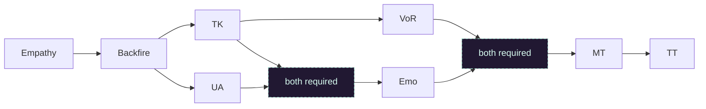

# 4 Mez 3-3

:::warning Tactics being reworked
Due to the [June 24, 2026 game update](https://wiki.guildwars.com/wiki/Feedback:Game_updates/20260624), all tactics are currently being reworked.
:::

3-3 is the baseline teaching format. It introduces the core DoA rhythm: communication, spike discipline, clean aggro and targeting while being fast and safe.

## Roles

| Role | Focus | Page |
| --- | --- | --- |
| Empathy | Main ball spiker. Good single target damage & [C-target](/tactics/glossary#c-target) management thanks to [Empathy] and [Spiritual pain]. | [Open role](/tactics/4-mesmers-3-3/empathy) |
| Backfire | Main ball spiker. Good caster killer thanks to [Backfire]. | [Open role](/tactics/4-mesmers-3-3/backfire) |
| TK | Deals with off-damage by putting them on [Edge of extinction] range. | [Open role](/tactics/4-mesmers-3-3/tk) |
| VoR | Main ball spiker and caller. Massive damage output thanks to [Visions of regret]. | [Open role](/tactics/4-mesmers-3-3/vor) |
| UA | Massive healing through [Seed of life] & fast rez with [Unyielding aura], places [Edge of extinction]. | [Open role](/tactics/4-mesmers-3-3/ua) |
| Emo | Keeps everyone alive through [Protective bond]. Infinite energy pool with [Ether renewal]. | [Open role](/tactics/4-mesmers-3-3/emo) |
| MT | Main [Shadow form] tank, stays with the team and benefits from emo bonds for extra survivability. | [Open role](/tactics/4-mesmers-3-3/mt) |
| TT | Secondary [Shadow form] tank, splits from the main team on several occasions. | [Open role](/tactics/4-mesmers-3-3/tt) |

## Team build

[bar Empathy;OQpjAwCc6QLBnAmO0laATP2k4UA]

[bar Backfire;OQhjAwCMYQLBnAmO0lcATP2k3UA]

[bar TK;OQdCAsw0SwJgpTQgc50TMZnD]

[bar VoR;OQljAwCs5QuNbAmOCOwlTP2k0l]

[bar UA;OwIT8MIbX6uKHUuE6gukhAg4BEA]

[bar Emo;OgNDwcPPTaR3MkE1C0lyDxDHEA]

[bar MT;OwFkUld5HPOENpOTDECEujN5BUnD]

[bar TT;OwFkMOd5HXlENpODuDCUDUozBUnD]

## Teach discords

Teach discords will help you learn the basics of the role and the build.
Your first role will be [Empathy], which is the easiest to learn.
Ensure you have the required gear, pcons and titles from the [Mesmer gear](/tactics/gear/mesmer) page and ask for a gear check in those discords.
Take a look at the fundamentals page before your first run [here](/tactics/fundamentals).

<a className="discord-link" href="https://discord.gg/3Txr4x6" target="_blank" rel="noopener noreferrer">
  
  Inter teaching discord
</a>

## Role progression

## Spiking guide

<a className="sheet-link" href="https://docs.google.com/spreadsheets/d/1dbjrpHoNL4M5vv2LfoL-CXThFagY5E4vlqU5rBZi6rc/edit?gid=1982078469#gid=1982078469" target="_blank" rel="noopener noreferrer">
  
  Open the 3-3 spiking sheet
</a>

<a className="sheet-link" href="https://docs.google.com/spreadsheets/d/1xBa5QLMmXjeN8pAyyvFPMx7Z9rya23MNFoDjp3rgv_8/edit?gid=2025571967#gid=2025571967" target="_blank" rel="noopener noreferrer">
  
  Open the 3-3 spiking sheet in french
</a>

It tries to theorycraft the optimal spikes for each role on each situation by avoiding overlaps and separating concerns but be ready to improvise as every run is different.
