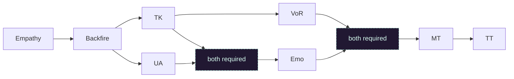

# 4 Mez 3-3

3-3 est le format d'apprentissage de base. Il introduit le rythme du DoA : communication, discipline de spike, aggro propre et ciblage, tout en restant rapide et sûr.

## Rôles

| Rôle | Focus | Page |
| --- | --- | --- |
| Empathy | Main ball spiker. Bon single target damage et gestion des [C-target](/tactics/glossary#c-target) grâce à [Empathy] et [Spiritual pain]. | [Ouvrir le rôle](/tactics/4-mesmers-3-3/empathy) |
| Backfire | Main ball spiker. Très fort contre les casters grâce à [Backfire]. | [Ouvrir le rôle](/tactics/4-mesmers-3-3/backfire) |
| TK | Gère l'off-damage en le mettant à portée de [Edge of extinction]. | [Ouvrir le rôle](/tactics/4-mesmers-3-3/tk) |
| VoR | Main ball spiker et caller. Gros damage output grâce à [Visions of regret]. | [Ouvrir le rôle](/tactics/4-mesmers-3-3/vor) |
| UA | Gros potentiel de heal avec [Seed of life], rez rapide avec [Unyielding aura], place [Edge of extinction]. | [Ouvrir le rôle](/tactics/4-mesmers-3-3/ua) |
| Emo | Garde tout le monde en vie avec [Protective bond]. Pool d'énergie infinie grâce à [Ether renewal]. | [Ouvrir le rôle](/tactics/4-mesmers-3-3/emo) |
| MT | Main [Shadow form] tank, reste avec la team et profite des bonds de l'Emo pour plus de survivabilité. | [Ouvrir le rôle](/tactics/4-mesmers-3-3/mt) |
| TT | Secondary [Shadow form] tank, split de la main team à plusieurs moments. | [Ouvrir le rôle](/tactics/4-mesmers-3-3/tt) |

## Team build

[bar Empathy;OQpjAwCc6QLBnAmO0laATP2k4UA]

[bar Backfire;OQhjAwCMYQLBnAmO0lcATP2k3UA]

[bar TK;OQdCAsw0SwJgpTQgc50TMZnD]

[bar VoR;OQljAwCs5QuNbAmOCOwlTP2k0l]

[bar UA;OwIT8MIbX6uKHUuE6gukhAg4BEA]

[bar Emo;OgNDwcPPTaR3MkE1C0lyDxDHEA]

[bar MT;OwFkUld5HPOENpOTDECEujN5BUnD]

_Ajustez le niveau de Tactics selon le requirement du shield et les pcons supplémentaires utilisés._

[bar TT;OwFkMOd5HXlENpODuDCUDUozBUnD]

_Ajustez le niveau de Tactics selon le requirement du shield et les pcons supplémentaires utilisés._

## Teach discords

Les teach discords vous aideront à apprendre les bases du rôle et du build.
Votre premier rôle sera [Empathy], qui est le plus simple à apprendre.
Assurez-vous d'avoir le gear, les pcons et les titres requis depuis la page [Mesmer gear](/tactics/gear/mesmer), puis demandez un gear check sur ces discords.
Lisez aussi la page des fondamentaux avant votre première run [ici](/tactics/fundamentals).

<a className="discord-link" href="https://discord.gg/3Txr4x6" target="_blank" rel="noopener noreferrer">
  
  Discord teach international
</a>

## Progression des rôles

## Spiking guide

<a className="sheet-link" href="https://docs.google.com/spreadsheets/d/1dbjrpHoNL4M5vv2LfoL-CXThFagY5E4vlqU5rBZi6rc/edit?gid=1982078469#gid=1982078469" target="_blank" rel="noopener noreferrer">
  
  Ouvrir la sheet de spike 3-3
</a>

<a className="sheet-link" href="https://docs.google.com/spreadsheets/d/1xBa5QLMmXjeN8pAyyvFPMx7Z9rya23MNFoDjp3rgv_8/edit?gid=2025571967#gid=2025571967" target="_blank" rel="noopener noreferrer">
  
  Ouvrir la sheet de spike 3-3 FR
</a>

Cette sheet essaie de theorycraft les spikes optimaux pour chaque rôle et chaque situation, en évitant les overlaps et en séparant les responsabilités. Soyez tout de même prêts à improviser : chaque run est différente.
